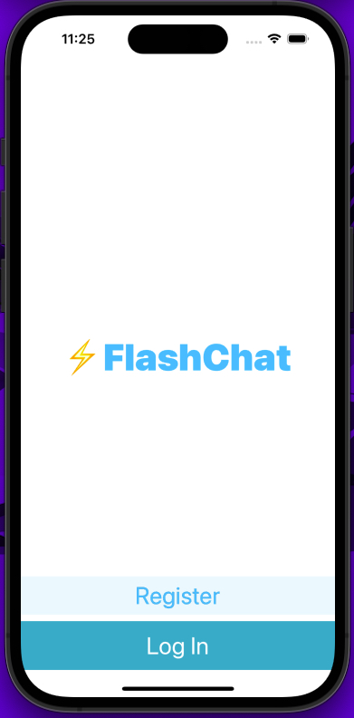
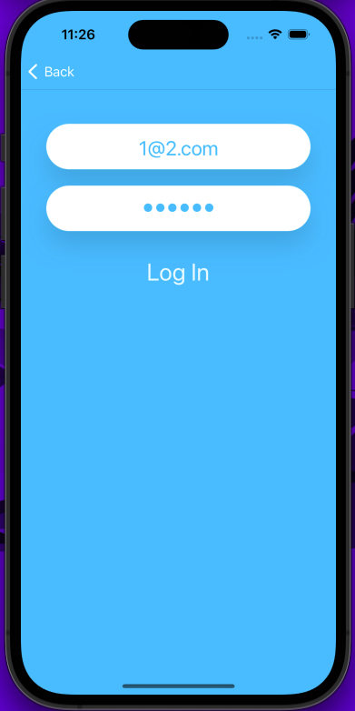
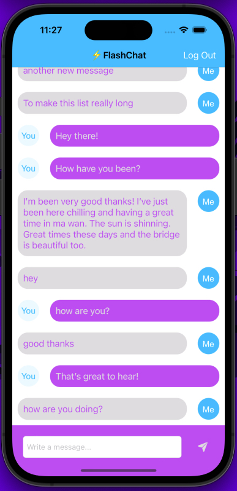
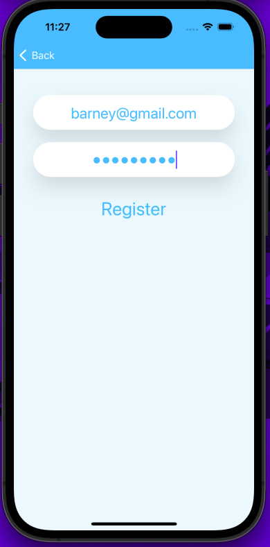
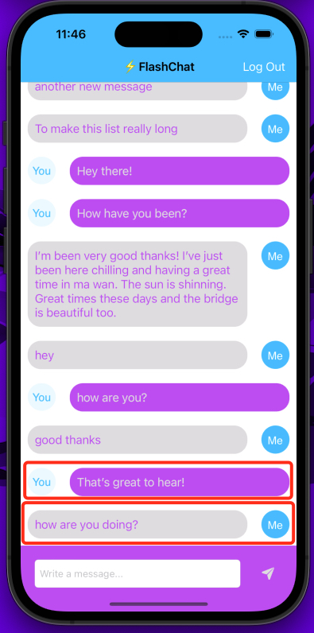
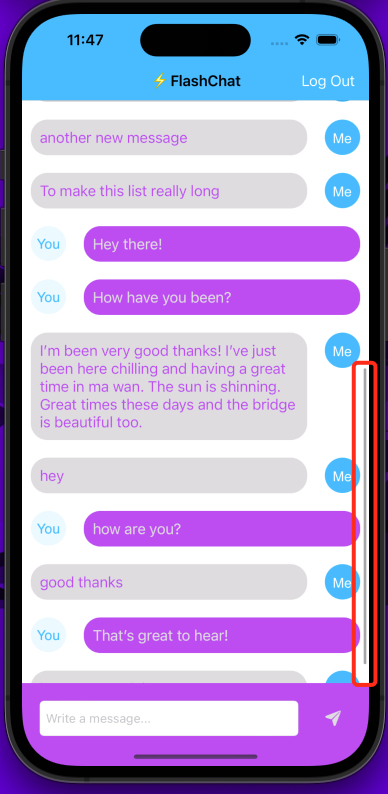

# WhatsApp Copy - FlashChat App

**Table of Contents**
- [Introduction](#introduction)
- [Motivation](#motivation)
- [Technology Used](#technologyUsed)
- [Build Status](#buildStatus)
- [Features](#features)
- [Installation](#installation)
- [Execution](#execution)

## Introduction 
Mobile full stack WhatsApp copy app where users can register, login and message each other in a chatroom. Messages are stored in Google Firebase.

## Motivation 
This is a personal learning project aimed to teach me the Table View. Table Views are used everywhere from the Mail app to Messages app. It's a crucial part of every iOS app. Thus, I want to get to grips with Table Views, creating custom cells, and making my own cloud-based backend database.

## Technology Used 
<table>
  <tbody>
    <tr>
      <td>Language</td>
      <td>Swift</td>
    </tr>
    <tr>
      <td>Notable Technology Utilized</td>
      <td>
        <ul>
          <li>Storyboard</li>
          <li>Storing data in the cloud using Firebase Firestore</li>
          <li>Querying and sorting Firebase database</li>
          <li>Firebase for user authentication, registration and login</li>
          <li>Using UITableViews and setting their data sources and delegates</li>
          <li>Creating custom views using .xib files to modify native design components</li>
          <li>Embedding View Controllers in a Navigation Controller and understanding navigation stack</li>
          <li>Creating constants file and use static properties to store Strings and other constants</li>
          <li>Create animations using loops</li>
          <li>Using direct Segues for navigation</li>
        </ul>
      </td>
    </tr>
  </tbody>
</table>

## Build Status 
Project is completed.

## Features 
- Register new users
- Login for existing users
- Chat window - custom cells for different users 
- Chat window - Scrollable and ordered list 
- Chat window - Retrieval of cloud stored messages
- Chat window - Keyboard pushes up screen
- Chat window - Send a message
- Chat window - Logout 

### Register new users

* User can register a new account by typing in a unique name and password longer than 6 characters.
* Registration is created through FireBase.

### Login for existing users

* Existing users can login through the login screen
* Authentication is done through FireBase.

### Chat window - custom cells for different users 

* Logged in user will have a custom .XIB message cell compared to the sender
* Custom cells will hide and display cell contents based on back-end logic

### Chat window - Scrollable and ordered list 

* User can scroll up for previous messages
* Messages are ordered based on the message created timestamp

### Chat window - Retrieval of cloud stored messages

* User can view detailed information about a particular landmark they selected in the featured or list activity window
* Information includes title, text location, geographical map, and description

### Chat window - Keyboard pushes up screen

* User can toggle on/off if a landmark should be favourited or not

### Chat window - Send a message

* User can interact with the map on the detail activity window to view the surrounding area

### Chat window - Logout

* User can interact with the map on the detail activity window to view the surrounding area

# Installation 
* Ensure XCode is installed (only available on MacOS)

# Execution 
* Open the Landmarks.xcodeproj file in XCode
* Once the project is open you can click the play button at the top of the IDE to run the iPhone simulator
